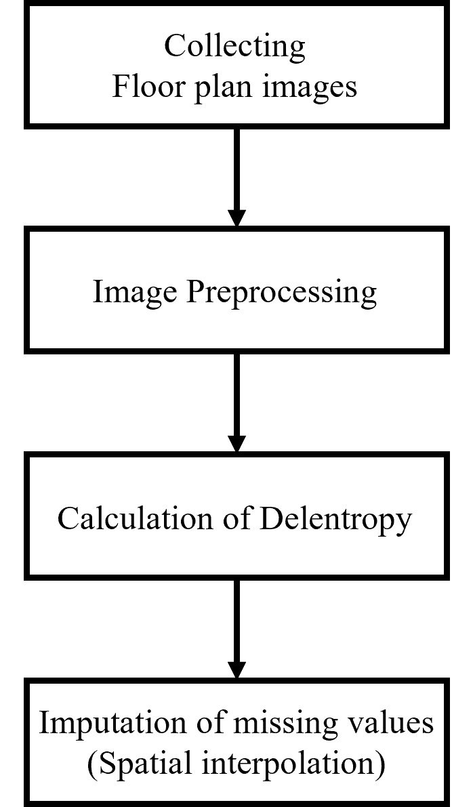

# Floor Complexity Data Records
   
We introduce an indicator called 'Floor complexity', based on the floor plan images in Busan, Daegu, Daejeon, and Gwangju.

To drive the floor complexity index, we collect floor plan images, refine images, calculate Delentropy, and implement spatial interpolation. 
<p align="center">
   <br>
  Figure 1. Steps to obtain floor complexity index
</p>

This four-step process is necessary to effectively compute the green index, and sample data was stored in the 'DATA' folder to replicate this calculation.

Data in this repository consists of Excel and CSV files:

## Image Preprocessing
The raw data of floor plan images are stored in the *'RAW DATA'* folder. These raw images contain not only spatial information of the floor plans but also structural lengths, lines, and other details that can introduce noise during the delentropy calculation process. Since delentropy is determined by changes in grayscale levels between pixels, image preprocessing is essential to minimize noise and ensure accurate computation. 

To refine the images for this purpose, edge detection is applied to extract the edges of the floor plans, followed by creating closed-form images and blurring the areas outside these closed forms. The processed images are then saved in the *'FLOOR PLAN IMAGE'* folder.

<p align="center">
   <br>
  Figure 2. Image preprocessing.
</p>   

The follwing code is to perform above step:
```python
import cv2
import numpy as np
import os
from PIL import Image

def apply_canny_and_morphology(image):
    blur = cv2.GaussianBlur(image, (5, 5), 0)
    edged = cv2.Canny(blur, 10, 250)
    kernel = cv2.getStructuringElement(cv2.MORPH_RECT, (5, 5))
    dilated = cv2.dilate(edged, kernel, iterations=3)
    closed = cv2.morphologyEx(dilated, cv2.MORPH_CLOSE, kernel)
    dilate_kernel = cv2.getStructuringElement(cv2.MORPH_RECT, (9, 9))
    dilated_filled = cv2.dilate(closed, dilate_kernel, iterations=3)
    return edged, dilated_filled

def find_and_mask_contours(image, closed):
    contours, _ = cv2.findContours(closed.copy(), cv2.RETR_EXTERNAL, cv2.CHAIN_APPROX_SIMPLE)
    mask = np.zeros(image.shape[:2], dtype=np.uint8)
    cv2.drawContours(mask, contours, -1, 255, thickness=cv2.FILLED)
    result = image.copy()
    result[mask == 0] = [255, 255, 255]
    return result, contours

def process_image(image):
    edged, dilated = apply_canny_and_morphology(image)
    processed_image, _ = find_and_mask_contours(image, dilated)
    return processed_image

def main(input_dir, output_dir):
    if not os.path.exists(output_dir):
        os.makedirs(output_dir)

    image_files = os.listdir(input_dir)
    for idx, file_name in enumerate(image_files):
        input_image_path = os.path.join(input_dir, file_name)
        output_image_path = os.path.join(output_dir, file_name)
        print(f"Processing {idx + 1}/{len(image_files)}: {file_name}")
        
        try:
            image = Image.open(input_image_path)
            img_np = np.array(image)
            processed_image = process_image(img_np)
            result_image = Image.fromarray(processed_image)
            result_image.save(output_image_path)
        except Exception as e:
            print(f"Error processing {file_name}: {e}")

if __name__ == "__main__":
    base_dir = "images"
    output_base_dir = "processed_images"
    cities = ["bs", "dg", "dj", "gw"]

    for city in cities:
        input_dir = os.path.join(base_dir, city)
        output_dir = os.path.join(output_base_dir, city)
        main(input_dir, output_dir)
```

## Calculation of Delentropy
Delentropy utilizes Deldensity as its probability density function, where Deldensity is derived using the following formula:
```math
p_{i,j}= \frac{1}{MN}\sum^M_{m=1} \sum^N_{n=1} \delta(\nabla_x f(m,n) - i, \nabla_y f(m,n)-j)
```

Based on the calculated Deldensity, Delentropy is then determined using the following equation:
```math
H(f)=-\sum_{i,j}p_{i,j} \log{p_{i,j}}
```

The follwing code is to calculate Delentropy:
```python
import os
import pandas as pd
from PIL import Image
import numpy as np
from scipy.signal import convolve2d

def grayscale(image_path):
  image = Image.open(image_path)
  # Converted to grayscale
  grayscale_image = image.convert('L')
  grayscale_array = np.array(grayscale_image)
  return grayscale_array

def delentropy_2d(image):
  image_with_nan = np.where(image == 255, np.nan, image)

  gradient_x = np.array([[1,-1], [1,-1]])/2
  gradient_y = np.array([[1,1], [-1, -1]])/2

  fx = convolve2d(image_with_nan, gradient_x, mode='valid', boundary='fill', fillvalue=np.nan)
  fy = convolve2d(image_with_nan, gradient_y, mode='valid', boundary='fill', fillvalue=np.nan)

  histogram, _, _ = np.histogram2d(fx[~np.isnan(fx)], fy[~np.isnan(fy)], bins=[511, 511], range=[[-255, 255], [-255, 255]])

  probability = histogram / np.sum(histogram)
  delentropy = -np.sum(probability * np.log2(probability + np.finfo(float).eps))
  return delentropy

area = ['bs', 'dg', 'dj', 'gw']

for i in range(0,len(area)):
    name = area[i]
    index = os.listdir(f"image_{name}")
    df_index = [name.rstrip('.jpg') for name in index]
    image_file = f"image_{name}\\"

    busan = pd.DataFrame()
    busan['index'] = ''
    busan['delentropy'] = ''

    del_value = []
    del_index = []
    a = 0

    for i in range(0, len(os.listdir(f"image_{name}"))):
        image_path = str(image_file) + str(df_index[i]) + '.jpg'
        gray_image = grayscale(image_path)
        del_image = delentropy_2d(gray_image)
        del_index.append(df_index[i])
        del_value.append(del_image)
        print(a, '/', len(df_index))
        a+=1

    busan['index'] = del_index
    busan['delentropy'] = del_value
    busan.to_csv(f'Delentropy\del_{name}.csv', index=False)

```


## Spatial Interpolation
Spatial interpolation step can be utilized to remedy the uneven spatial distribution of GSV images.   
To implement the spatial interpolation method, refer to the sample data file named *'Data.csv'* and *Street Greenness.csv*.    
The columns required to effectively manage the green index are as follows:   

*Data.csv*
- x: Longitude in the Cartesian coordinate system of the transaction point
- y: Latitude in the Cartesian coordinate system of the transaction point
   
*Street Greenness.csv*
- Longitude: Longitude of GSV image
- Latitude: Latitude of GSV image
- Green Index: Calculated street greenness

Spatial interpolation requires the distance between two objects based on longitude and latitude. It can be obtained by using haversine formula as follows:

```math
d_{\text{haversine}} = 2 \times R \times \arcsin\left(\sqrt{\sin^2\left(\frac{\Delta \text{lat}}{2}\right) + \cos(\text{lat}_p) \cos(\text{lat}_g) \sin^2\left(\frac{\Delta \text{lng}}{2}\right)}\right)
```

   
<p align="center">
   <br>
  Figure 3. Graphical description of spatial interpolation.
</p>   

The following code uses above mathematical form and aggregates the green index with 50 images closest to the transaction point. The final result file is in *Green Index_Spatial Interpolation_bs.csv*.
```python
import pandas as pd
import pandas as pd
from haversine import haversine

area = ['bs', 'dg', 'dj', 'gw']

for i in range(0, len(area)):
    name = area[i]

    df = pd.read_excel(f'Delentropy\df_{name}.xlsx')
    df['Delentropy'] = ''
    delentropy = pd.read_csv(f'Delentropy\del_{name}.csv')

    df['index'] = df['index'].astype(str)
    delentropy['index'] = delentropy['index'].astype(str)

    del_df = pd.merge(df, delentropy, on=['index'], how ='left')
    del_df.drop(columns = ['Delentropy'], inplace=True)
    del_df.to_excel(f'Delentropy\df_{name}_del.xlsx', index=False)

    ## Spatial Interpolation
    del_df_1 = del_df[del_df['delentropy'].isna()].reset_index()
    dff = del_df[['Latitude', 'Longitude', 'delentropy']].copy()
    dff = dff[dff['delentropy'].notna()].drop_duplicates().reset_index(drop=True)

    Aggregated_Entropy = []
    Aggregated_Entropy_Distance = []
    del_df['delentropy_d'] = ''

    a = 0

    for y, x, ind in zip(del_df_1['Latitude'], del_df_1['Longitude'], del_df_1.index):
        distance = []

        for en_y, en_x, hgvi in zip(dff['Latitude'], dff['Longitude'], dff['delentropy']):
            dis = haversine([y,x], [en_y, en_x], unit='km')
            distance.append([x,y,en_x,en_y,dis,hgvi])
        dis_df = pd.DataFrame(distance)
        dis_df.columns = ['x','y','en_x','en_y','distance','HGVI']
        dis_df = dis_df.sort_values('distance', ascending=True)

        # Extract the 100 nearest green indices
        dis_df_100 = dis_df.iloc[:100]

        mean_hgvi_100 = dis_df_100['HGVI'].mean()
        mean_dis_100 = dis_df_100['distance'].mean()

        Aggregated_Entropy.append(mean_hgvi_100)
        Aggregated_Entropy_Distance.append(mean_dis_100)

        a += 1

        print(a, '/', len(del_df_1))

    del_df_1['delntropy'] = Aggregated_Entropy
    del_df_1['delentropy_d'] = Aggregated_Entropy_Distance

    for i in range(0,len(del_df_1)):
        del_df['delentropy'][del_df_1['level_0'][i]] = Aggregated_Entropy[i]
        del_df['delentropy_d'][del_df_1['level_0'][i]] = Aggregated_Entropy_Distance[i]

    del_df.to_csv(f'Delentropy\spatial_interpolation_{name}.csv',index=False,encoding='utf-8-sig')
```
Through this process, we can get the green index for all points of transaction and all information of hedonic variables including green index is in *Hedonic Dataset.xlsx*.
